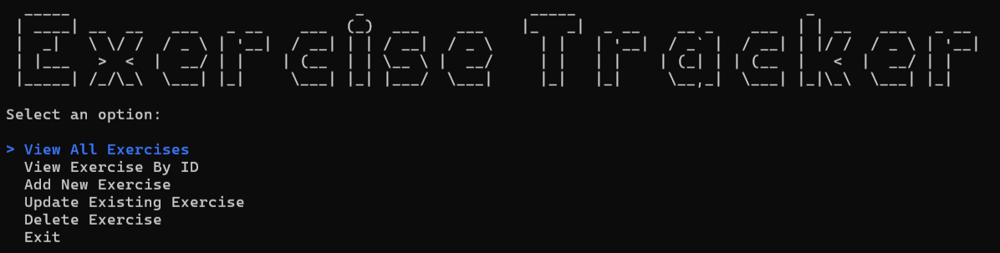
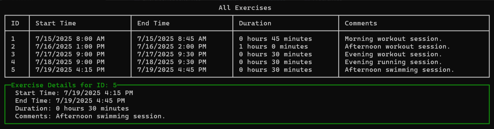

# Exercise Tracker

A simple .NET Console Application for tracking exercises, built using the Repository Pattern and Entity Framework.



## Features

- Add, update, and delete exercise records
- List all exercises
- Search logged exercises by ID
- Persistent storage with Entity Framework Core and SQL Server



## Getting Started

1. **Clone the repository:**

   ```bash
   git clone https://github.com/andymartinez1/Exercise-Tracker.git
   ```

2. **Move to the project directory:**

   ```bash
   cd Exercise-Tracker
   ```

3. **Restore dependencies:**

   ```bash
   dotnet restore
   ```

4. **Update the database:**

   ```bash
   dotnet ef database update
   ```

5. **Run the application:**
   ```bash
   dotnet run
   ```

## Project Structure

- `Models/` - Entity classes (e.g., `Exercise.cs`)
- `Data/` - EF Core DbContext and migrations
- `Repositories/` - Repository interfaces and implementations
- `Program.cs` - Entry point and UI logic

## UI Usage

- **View All Exercises:**: See all logged exercises in a table.
- **View Exercise by ID**: See detailed information of each exercise
- **Create Exercise:**: Use the form to log a new exercise.
- **Update/Delete:**: Manage existing exercises directly from the UI.

## Technologies Used

- C#
- Entity Framework
- SQL Server
- Spectre Console
